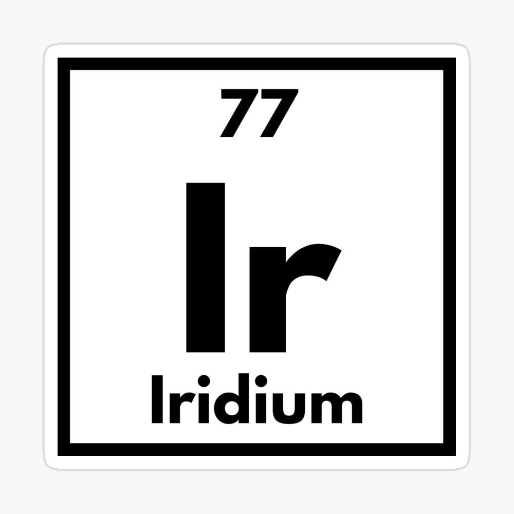

# Iridium

Iridium is a free and open-source Minecraft mod which replaces the game rendering and audio engine implementations with ones that make use of Vulkan and FMOD respectively. The goal of Iridium is to make Minecraft more enjoyable by providing increased frame rates with Vulkan and a better (and potentially more immersive) audio experience with FMOD.

Currently, Iridium is still in active development so expect instability issues, rendering/audio bugs and/or crashes. In addition, due to FMOD being a part LWJGL 3.3.2 and (at the time of writing) it not being in stable release, FMOD support will not be worked on until LWJGL 3.3.2 is in stable release and Minecraft has been updated to that version of LWJGL. For now, Vulkan support is the primary focus of the mod's development.

---

## Installation ⬇️

Currently, no JAR releases of Iridium are being distributed. If you would like to install the mod, please follow the section going over [building the mod from its source code](#building-from-source-) and installing the JAR as a result of that.

---

## Reporting Issues ⚠️

You can report any issues you encounter with Iridium via the [issue tracker](https://github.com/YoArchh/Iridium/issues). However, before opening a new issues, please use the tracker's search tool to make sure your issue hasn't already been reported. This is simply just avoid duplicate issues. Any and all duplicate issues, if and when found, will be closed immediately.

While you are welcome to use the issue tracker to other submit things like feature requests, its primary use is for improving Iridium. So fixing bugs/crashes, improving performance and fixing performance issues, improving hardware compatibility and more.

---

## Building From Source 🔨

**This section still has to be written. Please check again at a later date.**

---

## License 📃

Iridium is licensed under GNU LGPLv3, a free and open-source license. For information, please refer to the [license file](LICENSE).